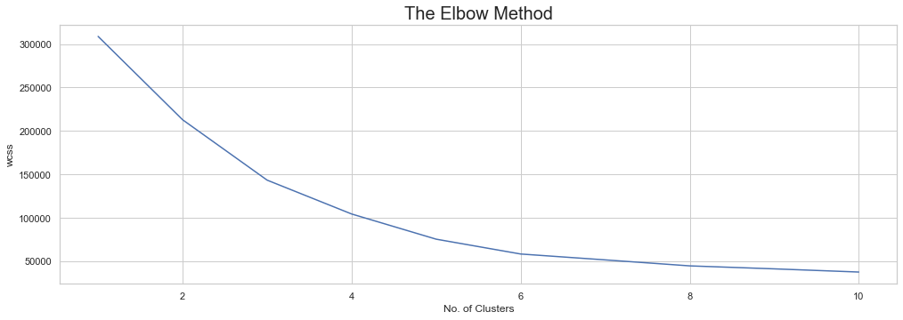
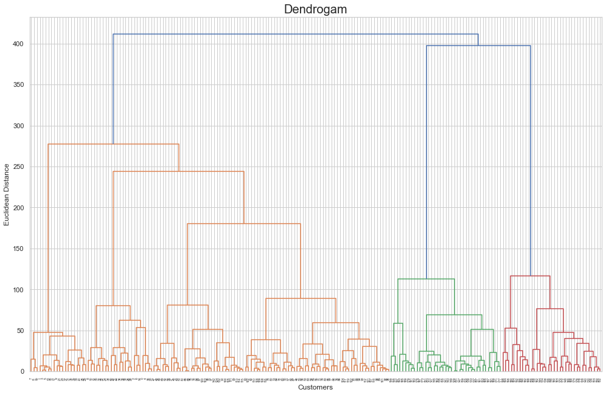

# Clustering Mall Customer

## Project Overview
The project to determine number of cluster can be applied on a mall customer data. I am performing comprehensive EDA on Mall Customer dataset to understand important variables, outliers, and ensemble machine learning models to predict new data to find out which data are in crisis. The model used for this project are K-means and Hierarchial Clustering.

## Framework Steps:
1. Data Preparation
2. Data Cleaning
3. EDA
4. Modeling

## Result

